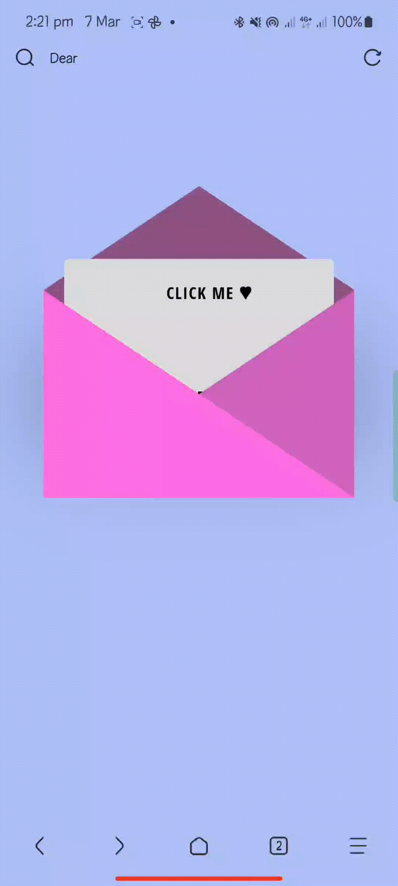

# 💌 Dear ILY  

**Dear ILY** adalah halaman web sederhana dengan efek amplop interaktif yang berisi pesan cinta, namun anda dapat menggantinya dengan pesan apapun. Saat pengguna mengarahkan kursor ke amplop, kartu akan muncul dengan pesan di dalamnya.  

## 📷 Preview  
<div style="text-align: center;">
  
  
</div> 

## 🚀 Fitur  
- Desain responsif dan interaktif  
- Efek hover untuk membuka kartu dari dalam amplop  
- Menggunakan CSS dan HTML murni  

## 🛠️ Teknologi yang Digunakan  
- **HTML** untuk struktur halaman  
- **CSS** untuk desain dan animasi  

## 📌 Cara Menjalankan  
1. Clone repository ini atau unduh file secara manual:  
   ```bash
   git clone https://github.com/irfannurf21/dear-ILY.git
   ```
2. Buka file ```index.html``` di browser pc maupun smartphone

## 🎨 Kustomisasi
- Ubah pesan di dalam kartu dengan mengganti teks dalam elemen <p> di file dear-ily.html.
- Modifikasi warna dan desain dengan mengedit kode CSS.

## 🤝 Kontribusi
Silakan fork repository ini dan buat pull request jika ingin menambahkan fitur baru.

## 📜 Lisensi
Proyek ini dibuat untuk tujuan edukasi dan bebas digunakan.
